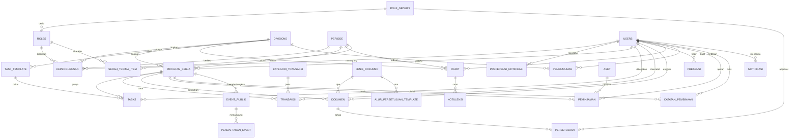

# Canopy

Platform manajemen OSIS untuk SMKN 1 Cibinong. Canopy menyatukan pengelolaan kepengurusan, program kerja, tugas, keuangan, rapat, presensi, dokumen, aset, notifikasi, serah terima, dan portal publik dalam satu aplikasi.

---

## 🚀 Teknologi

| Area | Teknologi |
|---|---|
| **Frontend** | Next.js 16, React 19, TypeScript, Tailwind CSS 4 |
| **Backend** | Go dan Encore.cloud |
| **Database** | PostgreSQL melalui Encore SQL databases |
| **Autentikasi** | NIS + password bcrypt + JWT |

---

## 📂 Struktur Repository

```text
Canopy/
├── frontend/                 Aplikasi Next.js
│   ├── src/app/              Halaman dan layout App Router
│   ├── src/components/       Komponen UI bersama
│   ├── src/lib/              Klien API, autentikasi, dan logika akses
│   └── public/               Aset statis
├── backend/                  Aplikasi Encore.cloud
│   ├── user/                 Identitas, autentikasi, role, periode
│   ├── division/             Divisi dan navigasi berbasis modul
│   ├── proker/               Program kerja, task, template, pembinaan
│   ├── finance/              Transaksi dan pengajuan dana
│   ├── meeting/              Rapat, notulensi, presensi, pengumuman
│   ├── approval/             Dokumen dan approval berjenjang
│   ├── asset/                Aset dan peminjaman
│   ├── handover/             Serah terima periode
│   ├── notification/         Notifikasi in-app
│   ├── public/               Event dan aspirasi publik
│   └── special/              Modul khusus per Sekbid
├── roles/                    Spesifikasi inti domain dan RBAC
└── System extend/            Spesifikasi autentikasi, notifikasi, setting, publik
```

---

## ⚙️ Prasyarat

Pasang perangkat berikut sebelum menjalankan aplikasi:

- Node.js 20 atau lebih baru dan npm.
- Encore CLI.
- Akun Encore yang mempunyai akses ke aplikasi `canopy-3xyi` bila memakai environment cloud.

Verifikasi instalasi:

```powershell
node --version
npm --version
encore version
```

---

## 🛠️ Setup Lokal

### 1. Clone dan masuk ke repository

```powershell
git clone <repository-url> Canopy
Set-Location Canopy
```

### 2. Konfigurasi backend

Encore mengelola PostgreSQL dan menerapkan file migrasi SQL otomatis ketika aplikasi dijalankan. Masuk atau tautkan aplikasi Encore jika diperlukan:

```powershell
encore auth login
Set-Location backend
encore run
```

Backend lokal berjalan di port yang ditentukan Encore, umumnya `http://localhost:4000`. Biarkan proses ini tetap aktif.

> Setiap paket backend mempunyai database Encore sendiri. Migrasi berada di `<service>/migrations/*.up.sql` dan diterapkan berurutan oleh Encore.

### 3. Konfigurasi frontend

Buka terminal baru:

```powershell
Set-Location frontend
npm ci
```

Buat atau ubah `frontend/.env.local` untuk menunjuk ke backend lokal:

```dotenv
NEXT_PUBLIC_API_URL=http://localhost:4000
```

Jalankan frontend:

```powershell
npm run dev
```

Akses aplikasi di `http://localhost:3000`.

---

## 💻 Perintah Pengembangan

| Lokasi | Perintah | Fungsi |
|---|---|---|
| `frontend/` | `npm run dev` | Menjalankan Next.js development server |
| `frontend/` | `npm run lint` | Menjalankan ESLint |
| `frontend/` | `npx tsc --noEmit` | Mengecek tipe TypeScript |
| `frontend/` | `npm run build` | Membuat production build Next.js |
| `backend/` | `encore run` | Menjalankan Encore beserta database lokal |
| `backend/` | `encore check` | Mengecek kompilasi dan deklarasi Encore |
| `backend/` | `encore test ./...` | Menjalankan test backend |
| `backend/` | `encore db reset --all` | Menghapus dan membuat ulang seluruh database lokal |
| `backend/` | `encore db shell <database>` | Membuka `psql` untuk database service tertentu |

---

## 🌐 Konfigurasi Environment

Frontend membaca `NEXT_PUBLIC_API_URL` untuk base URL API. Nilai default di kode mengarah ke environment staging Encore, sehingga `.env.local` harus diarahkan ke `http://localhost:4000` saat development lokal.

Jangan commit kredensial, token, atau nilai rahasia. Konfigurasi non-publik harus disimpan melalui Encore secrets atau provider deployment, bukan dalam file source.

---

## 🏗️ Arsitektur Sistem

### 1. Frontend
Frontend dibangun menggunakan Next.js App Router:
- **Root layout**: `frontend/src/app/layout.tsx`.
- **Halaman login**: `frontend/src/app/page.tsx`.
- **Area internal terproteksi**: `frontend/src/app/dashboard/`.
- **Shared dashboard layout**: `frontend/src/app/dashboard/layout.tsx`.
- **Klien HTTP & Tipe API**: `frontend/src/lib/api.ts`.
- **State Sesi / Sesi Browser**: `frontend/src/lib/auth-context.tsx`.

Navigasi bersifat adaptif: desktop menggunakan sidebar, sedangkan mobile menggunakan bottom navigation dan drawer menu.

### 2. Backend
Backend menggunakan layanan Encore per domain. Endpoint bertanda `auth` harus melewati `user.AuthHandler`. Token JWT mengandung subjek NIS dan profil akses aktif yang selalu divalidasi ke database.
Batasan scope divisi dilakukan memakai rentang `scope_divisi_awal` sampai `scope_divisi_akhir` pada relasi role. Nilai kosong (null) berarti cakupan seluruh organisasi.

---

## 📊 Diagram ERD Lengkap (Mermaid)



---

## 🗄️ Skema Database Detail

Berikut adalah skema tabel lengkap berdasarkan 23 dokumen spesifikasi Canopy:

### 1. Modul Identitas & Organisasi

#### USERS
| Field | Tipe | Keterangan |
|---|---|---|
| `nis` (PK) | string | Nomor Induk Siswa unik |
| `nama` | string | Nama lengkap siswa |
| `jurusan` | string | Jurusan siswa (mis. SIJA) |
| `tahun_masuk` | int | Tahun masuk angkatan |
| `foto_url` | string (nullable) | URL foto profil |
| `password_hash` | string | Sandi terenkripsi (bcrypt) |
| `wajib_ganti_password` | boolean | True jika akun baru/baru direset |
| `last_login` | timestamp (nullable) | Waktu login terakhir |
| `failed_attempts` | int | Counter gagal login (default 0) |

#### ROLE_GROUPS
| Field | Tipe | Keterangan |
|---|---|---|
| `group_id` (PK) | int | ID grup |
| `group_name` | string | Nama grup (Pembina, Trimitra, Sekretaris, Bendahara, Kepala Divisi, Staf) |

#### ROLES
| Field | Tipe | Keterangan |
|---|---|---|
| `role_id` (PK) | int | ID role |
| `group_id` (FK) | int | Relasi ke `ROLE_GROUPS` |
| `role_name` | string | Nama jabatan (mis. "Ketua Trimitra", "Sekretaris 1") |
| `level` | int | Hierarki dalam grup (1 = tertinggi) |
| `scope_divisi_awal` (FK) | int (nullable) | Relasi ke `DIVISIONS.division_id` |
| `scope_divisi_akhir` (FK) | int (nullable) | Relasi ke `DIVISIONS.division_id` |

#### DIVISIONS
| Field | Tipe | Keterangan |
|---|---|---|
| `division_id` (PK) | int | ID Divisi / Sekbid (1-10) |
| `division_name` | string | Nama Seksi Bidang |

#### PERIODE
| Field | Tipe | Keterangan |
|---|---|---|
| `periode_id` (PK) | int | ID periode kepengurusan |
| `tahun_ajaran` | string | Tahun ajaran (mis. "2025/2026") |
| `saldo_awal` | decimal | Saldo awal otomatis carry-over |

#### KEPENGURUSAN
| Field | Tipe | Keterangan |
|---|---|---|
| `membership_id` (PK) | int | ID keanggotaan kepengurusan |
| `nis` (FK) | string | Relasi ke `USERS` |
| `role_id` (FK) | int | Relasi ke `ROLES` |
| `division_id` (FK) | int (nullable) | Relasi ke `DIVISIONS` |
| `periode_id` (FK) | int | Relasi ke `PERIODE` |
| `status` | enum | `Aktif`, `Nonaktif` |

#### MODULES
| Field | Tipe | Keterangan |
|---|---|---|
| `module_id` (PK) | int | ID Modul navigasi |
| `module_name` | string | Nama modul |
| `is_core` | boolean | True jika modul tampil untuk seluruh role |

#### ROLE_GROUP_MODULES
| Field | Tipe | Keterangan |
|---|---|---|
| `id` (PK) | int | ID relasi |
| `group_id` (FK) | int | Relasi ke `ROLE_GROUPS` |
| `module_id` (FK) | int | Relasi ke `MODULES` |

#### DIVISI_MODULES
| Field | Tipe | Keterangan |
|---|---|---|
| `id` (PK) | int | ID relasi |
| `division_id` (FK) | int | Relasi ke `DIVISIONS` |
| `module_id` (FK) | int | Relasi ke `MODULES` (Modul khusus sekbid) |

---

### 2. Modul Program Kerja & Task

#### PROGRAM_KERJA
| Field | Tipe | Keterangan |
|---|---|---|
| `proker_id` (PK) | int | ID Program Kerja |
| `division_id` (FK) | int (nullable) | Relasi ke `DIVISIONS` (Null jika lintas sekbid) |
| `periode_id` (FK) | int | Relasi ke `PERIODE` |
| `nama` | string | Nama program kerja |
| `deskripsi` | text | Deskripsi detail proker |
| `anggaran_disetujui` | decimal | Alokasi anggaran disetujui |
| `status` | enum | `Belum Mulai`, `Berjalan`, `Selesai`, `Dibatalkan` |
| `penanggung_jawab` (FK) | string | Relasi ke `USERS.nis` |
| `tanggal_mulai` | date | Waktu mulai pelaksanaan |
| `tanggal_selesai` | date | Waktu selesai pelaksanaan |

#### TASK_TEMPLATE
| Field | Tipe | Keterangan |
|---|---|---|
| `template_id` (PK) | int | ID Template Task |
| `division_id` (FK) | int | Relasi ke `DIVISIONS` |
| `nama_template` | string | Nama template kustom (mis. "Log Bazaar") |

#### TEMPLATE_FIELD
| Field | Tipe | Keterangan |
|---|---|---|
| `field_id` (PK) | int | ID field template |
| `template_id` (FK) | int | Relasi ke `TASK_TEMPLATE` |
| `label` | string | Label input field |
| `tipe_input` | enum | `Teks`, `Angka`, `Tanggal`, `Dropdown`, `File`, `Checkbox` |
| `opsi_dropdown` | text (nullable)| Opsi dropdown (dipisahkan koma) |
| `wajib` | boolean | Menandakan field wajib diisi |

#### TASKS
| Field | Tipe | Keterangan |
|---|---|---|
| `task_id` (PK) | int | ID Tugas |
| `proker_id` (FK) | int | Relasi ke `PROGRAM_KERJA` |
| `template_id` (FK) | int (nullable) | Relasi ke `TASK_TEMPLATE` |
| `scope` | enum | `Individual`, `General` |
| `assigned_to` (FK) | string (nullable)| Penerima tugas (relasi ke `USERS.nis`) |
| `offered_by` (FK) | string (nullable) | Penawar tugas jika berhalangan (relasi ke `USERS.nis`) |
| `title` | string | Judul tugas |
| `deadline` | date | Batas waktu pengerjaan |
| `status` | enum | `Tersedia`, `Ditugaskan`, `Ditawarkan`, `Selesai` |
| `custom_data` | JSON (nullable)| Data isian sesuai `TEMPLATE_FIELD` |
| `eskalasi_terkirim` | boolean | Penanda apakah notif eskalasi telah terkirim |

#### CATATAN_PEMBINAAN
| Field | Tipe | Keterangan |
|---|---|---|
| `catatan_id` (PK) | int | ID catatan |
| `proker_id` (FK) | int | Relasi ke `PROGRAM_KERJA` |
| `dibuat_oleh` (FK) | string | Pembuat catatan (relasi ke `USERS.nis` - Pembina) |
| `isi` | text | Catatan evaluasi/pembinaan |
| `tanggal` | timestamp | Waktu pembuatan |

---

### 3. Modul Keuangan

#### KATEGORI_TRANSAKSI
| Field | Tipe | Keterangan |
|---|---|---|
| `kategori_id` (PK) | int | ID kategori transaksi |
| `nama` | string | Nama kategori (mis. Konsumsi, Transport) |

#### TRANSAKSI
| Field | Tipe | Keterangan |
|---|---|---|
| `transaksi_id` (PK) | int | ID transaksi |
| `proker_id` (FK) | int | Relasi ke `PROGRAM_KERJA` |
| `kategori_id` (FK) | int | Relasi ke `KATEGORI_TRANSAKSI` |
| `dicatat_oleh` (FK) | string | Penginput (relasi ke `USERS.nis`) |
| `jenis` | enum | `Masuk`, `Keluar` |
| `nominal` | decimal | Nominal transaksi |
| `bukti_url` | string | URL bukti nota/kuitansi |
| `sumber` | enum | `Manual`, `Scan Nota` |
| `is_berisiko` | boolean | Menandakan transaksi bernominal besar |
| `status` | enum | `Menunggu Verifikasi`, `Menunggu Approval Umum`, `Disetujui`, `Ditolak` |
| `alasan_penolakan`| text (nullable) | Alasan penolakan dari Bendahara |
| `tanggal` | date | Tanggal transaksi aktual |
| `created_at` | timestamp | Waktu pencatatan sistem |

---

### 4. Modul Dokumen & Approval

#### JENIS_DOKUMEN
| Field | Tipe | Keterangan |
|---|---|---|
| `jenis_id` (PK) | int | ID jenis dokumen |
| `nama` | string | Nama jenis (Proposal, LPJ, Surat Tugas) |

#### ALUR_PERSETUJUAN_TEMPLATE
| Field | Tipe | Keterangan |
|---|---|---|
| `template_id` (PK) | int | ID template alur |
| `jenis_id` (FK) | int | Relasi ke `JENIS_DOKUMEN` |
| `urutan` | int | Urutan langkah approval (1, 2, 3...) |
| `approver_group_id` | int | Relasi ke `ROLE_GROUPS` |

#### DOKUMEN
| Field | Tipe | Keterangan |
|---|---|---|
| `dokumen_id` (PK) | int | ID Dokumen |
| `proker_id` (FK) | int (nullable) | Relasi ke `PROGRAM_KERJA` |
| `jenis_id` (FK) | int | Relasi ke `JENIS_DOKUMEN` |
| `diunggah_oleh` (FK)| string | Relasi ke `USERS.nis` |
| `diperiksa_oleh` (FK)| string (nullable)| Pemeriksa verifikasi administratif (relasi ke `USERS.nis`) |
| `file_url` | string | URL file dokumen |
| `is_eksternal` | boolean | True jika dokumen ditujukan keluar sekolah |
| `status` | enum | `Draft`, `Menunggu Kelengkapan`, `Perlu Revisi`, `Menunggu Approval Berjenjang`, `Disetujui` |
| `catatan_revisi` | text (nullable) | Catatan perbaikan dari approver |
| `versi` | int | Versi dokumen (dimulai dari 1) |

#### PERSETUJUAN
| Field | Tipe | Keterangan |
|---|---|---|
| `persetujuan_id` (PK)| int | ID riwayat persetujuan |
| `dokumen_id` (FK) | int | Relasi ke `DOKUMEN` |
| `urutan` | int | Urutan langkah approval |
| `approver_group_id` | int | Relasi ke `ROLE_GROUPS` |
| `disetujui_oleh` (FK)| string (nullable)| User yang menyetujui (relasi ke `USERS.nis`) |
| `keputusan` | enum | `Menunggu`, `Disetujui`, `Ditolak` |
| `catatan` | text (nullable) | Catatan/masukan dari approver |
| `waktu` | timestamp | Waktu keputusan diambil |

---

### 5. Modul Rapat & Notulensi

#### RAPAT
| Field | Tipe | Keterangan |
|---|---|---|
| `rapat_id` (PK) | int | ID Rapat |
| `periode_id` (FK) | int | Relasi ke `PERIODE` |
| `division_id` (FK) | int (nullable) | Relasi ke `DIVISIONS` (Null jika rapat umum) |
| `judul` | string | Topik/judul rapat |
| `tanggal` | datetime | Waktu rapat dilaksanakan |
| `lokasi` | string | Tempat rapat (fisik) |
| `link_online` | string (nullable) | Tautan rapat online (mis. GMeet) |
| `agenda` | text | Rincian agenda rapat |
| `jenis` | enum | `Rutin`, `Evaluasi`, `Koordinasi`, `Darurat` |
| `dibuat_oleh` (FK) | string | Relasi ke `USERS.nis` |
| `status` | enum | `Terjadwal`, `Berlangsung`, `Selesai` |
| `qr_code` | string | Token unik untuk presensi rapat |

#### RAPAT_RUTIN_TEMPLATE
| Field | Tipe | Keterangan |
|---|---|---|
| `template_id` (PK) | int | ID template rapat rutin |
| `division_id` (FK) | int (nullable) | Relasi ke `DIVISIONS` |
| `hari` | enum | `Senin` s.d. `Minggu` |
| `jam` | time | Jam mulai rapat |
| `lokasi` | string | Lokasi rapat tetap |
| `aktif` | boolean | Status aktif template |

#### NOTULENSI
| Field | Tipe | Keterangan |
|---|---|---|
| `notulensi_id` (PK) | int | ID Notulensi |
| `rapat_id` (FK) | int | Relasi ke `RAPAT` |
| `isi` | text | Catatan hasil rapat |
| `difinalisasi_oleh` | string (nullable)| Relasi ke `USERS.nis` |
| `status` | enum | `Draft`, `Final` |

---

### 6. Modul Presensi

#### PRESENSI
| Field | Tipe | Keterangan |
|---|---|---|
| `presensi_id` (PK) | int | ID presensi |
| `acara_type` | enum | `Rapat`, `Kegiatan` |
| `acara_id` | int | Polimorfis FK ke `RAPAT.rapat_id` atau `PROGRAM_KERJA.proker_id` |
| `nis` (FK) | string | Relasi ke `USERS` |
| `tipe` | enum | `Hadir`, `Izin`, `Sakit`, `Alpa` |
| `keterangan` | text (nullable) | Keterangan/alasan izin |
| `bukti_url` | string (nullable) | URL file surat sakit/surat izin |
| `foto_url` | string (nullable) | Selfie scan masuk (anti titip absen) |
| `status_verifikasi`| enum | `Menunggu`, `Disetujui`, `Ditolak` |
| `waktu_submit` | timestamp | Waktu pengiriman data presensi |

---

### 7. Modul Pengumuman, Aset & Serah Terima

#### PENGUMUMAN
| Field | Tipe | Keterangan |
|---|---|---|
| `pengumuman_id` (PK)| int | ID pengumuman |
| `judul` | string | Judul pengumuman |
| `isi` | text | Isi detail pengumuman |
| `dibuat_oleh` (FK) | string | Pembuat (relasi ke `USERS.nis`) |
| `target` | enum | `Organisasi`, `Divisi` |
| `division_id` (FK) | int (nullable) | Relasi ke `DIVISIONS` |
| `tanggal` | datetime | Waktu publikasi |

#### ASET
| Field | Tipe | Keterangan |
|---|---|---|
| `aset_id` (PK) | int | ID Aset |
| `nama` | string | Nama barang/sarana |
| `kategori` | string | Kategori (mis. Elektronik, Furnitur) |
| `kondisi` | enum | `Baik`, `Rusak Ringan`, `Rusak Berat` |
| `jumlah_total` | int | Total kuantitas aset |
| `lokasi_penyimpanan`| string | Lokasi penyimpanan fisik |
| `foto_url` | string (nullable) | Foto fisik aset |

#### PEMINJAMAN
| Field | Tipe | Keterangan |
|---|---|---|
| `peminjaman_id` (PK)| int | ID peminjaman |
| `aset_id` (FK) | int | Relasi ke `ASET` |
| `proker_id` (FK) | int (nullable) | Relasi ke `PROGRAM_KERJA` |
| `dipinjam_oleh` (FK) | string | Relasi ke `USERS.nis` |
| `jumlah_dipinjam` | int | Jumlah kuantitas dipinjam |
| `tanggal_pinjam` | date | Tanggal mulai peminjaman |
| `tanggal_kembali_rencana`| date | Estimasi pengembalian |
| `tanggal_kembali_aktual`| date (nullable) | Realisasi pengembalian |
| `kondisi_saat_kembali`| string (nullable)| Kondisi aset saat dikembalikan |
| `status` | enum | `Diajukan`, `Disetujui`, `Dipinjam`, `Dikembalikan`, `Terlambat`, `Ditolak` |
| `disetujui_oleh` (FK)| string (nullable)| Pengapprove peminjaman (relasi ke `USERS.nis`) |

#### SERAH_TERIMA_ITEM
| Field | Tipe | Keterangan |
|---|---|---|
| `item_id` (PK) | int | ID serah terima |
| `periode_id` (FK) | int | Relasi ke `PERIODE` |
| `role_id` (FK) | int | Relasi ke `ROLES` |
| `deskripsi` | string | Keterangan barang/kunci/password |
| `status` | enum | `Belum`, `Sudah Diserahkan` |
| `diserahkan_oleh` (FK)| string (nullable)| Pengurus lama (relasi ke `USERS.nis`) |
| `diterima_oleh` (FK) | string (nullable)| Pengurus baru (relasi ke `USERS.nis`) |
| `tanggal` | timestamp (nullable)| Waktu serah terima ditandatangani |

---

### 8. Sistem Notifikasi & Halaman Setting

#### PREFERENSI_NOTIFIKASI
| Field | Tipe | Keterangan |
|---|---|---|
| `nis` (FK) | string | Relasi ke `USERS.nis` |
| `kategori` | enum | `Task`, `Approval`, `Presensi`, `Keuangan`, `Aset`, `Sistem` |
| `aktif` | boolean | Default true |

#### NOTIFIKASI
| Field | Tipe | Keterangan |
|---|---|---|
| `notifikasi_id` (PK)| int | ID notifikasi |
| `nis` (FK) | string | Penerima (relasi ke `USERS.nis`) |
| `kategori` | enum | `Task`, `Approval`, `Presensi`, `Keuangan`, `Aset`, `Sistem` |
| `judul` | string | Judul pesan |
| `pesan` | text | Detail notifikasi |
| `link_ref` | string | Deep link internal (mis. `/task/12`) |
| `status` | enum | `Belum Dibaca`, `Dibaca` |
| `dibuat_at` | timestamp | Waktu dibuat |

---

### 9. Sisi Publik

#### EVENT_PUBLIK
| Field | Tipe | Keterangan |
|---|---|---|
| `event_id` (PK) | int | ID event publik |
| `proker_id` (FK) | int (nullable) | Hubungan ke proker internal |
| `judul` | string | Nama acara publik |
| `deskripsi` | text | Deskripsi kegiatan |
| `tanggal` | datetime | Waktu kegiatan |
| `kuota` | int (nullable) | Batas maksimal kuota pendaftar |
| `status` | enum | `Buka`, `Ditutup`, `Selesai` |

#### PENDAFTARAN_EVENT
| Field | Tipe | Keterangan |
|---|---|---|
| `pendaftaran_id` (PK)| int | ID registrasi |
| `event_id` (FK) | int | Relasi ke `EVENT_PUBLIK` |
| `nama_pendaftar` | string | Nama siswa pendaftar |
| `kelas` | string (nullable) | Kelas pendaftar |
| `kontak` | string | Nomor WA/Kontak |
| `waktu_daftar` | timestamp | Waktu pendaftaran masuk |

#### ASPIRASI
| Field | Tipe | Keterangan |
|---|---|---|
| `aspirasi_id` (PK) | int | ID aspirasi |
| `nama_pengirim` | string (nullable) | Nama pengirim (Null jika anonim) |
| `kategori` | string (nullable) | Kategori aspirasi |
| `isi` | text | Isi aspirasi/kritik/saran |
| `status` | enum | `Baru`, `Ditinjau`, `Ditindaklanjuti`, `Selesai` |
| `tanggapan` | text (nullable) | Tanggapan tertulis OSIS |
| `waktu` | timestamp | Waktu pengiriman |

---

## 🔐 Model Organisasi & RBAC (Role-Based Access Control)

### 1. Struktur Jabatan & Oversight BPH
Oversight Bidang dibagi menjadi dua wilayah koordinasi paralel:
- **BPH Kelompok 1**: Wakil Ketua 1, Sekretaris 1, Bendahara 1 mengawasi **Sekbid 1–5**.
- **BPH Kelompok 2**: Wakil Ketua 2, Sekretaris 2, Bendahara 2 mengawasi **Sekbid 6–10**.
- **Pimpinan Utama**: Ketua Trimitra, Sekretaris Umum, dan Bendahara Umum memegang kendali penuh di tingkat organisasi.

### 2. Matriks Detail Role & Scope
| Role | Group | Level | Scope Divisi | Cakupan Akses |
|---|---|---|---|---|
| **Pembina** | Pembina | 1 | Semua | Organisasi penuh (Read-Only) + Tulis Catatan Pembinaan |
| **Ketua Trimitra** | Trimitra | 1 | Semua | Organisasi penuh + Approval final org-wide |
| **Wakil Ketua 1** | Trimitra | 2 | Sekbid 1–5 | Approval tingkat Trimitra untuk Sekbid 1-5 |
| **Wakil Ketua 2** | Trimitra | 2 | Sekbid 6–10 | Approval tingkat Trimitra untuk Sekbid 6-10 |
| **Sekretaris Umum**| Sekretaris | 1 | Semua | Organisasi penuh, verifikasi dokumen eksternal, kelola users |
| **Sekretaris 1** | Sekretaris | 2 | Sekbid 1–5 | Administrasi dokumen, notulensi & presensi Sekbid 1-5 |
| **Sekretaris 2** | Sekretaris | 2 | Sekbid 6–10 | Administrasi dokumen, notulensi & presensi Sekbid 6-10 |
| **Bendahara Umum** | Bendahara | 1 | Semua | Organisasi penuh, kelola transaksi berisiko/nominal besar |
| **Bendahara 1** | Bendahara | 2 | Sekbid 1–5 | Pencatatan & verifikasi keuangan Sekbid 1-5 |
| **Bendahara 2** | Bendahara | 2 | Sekbid 6–10 | Pencatatan & verifikasi keuangan Sekbid 6-10 |
| **Ketua Divisi** | Kepala Divisi| 1 | 1 Sekbid | Kelola program kerja divisi, buat template task, approval divisi |
| **Staf** | Staf | 2 | 1 Sekbid | Akses pengerjaan tugas & presensi internal divisinya sendiri |

### 3. Logika Resolusi Akses
Ketika user login, hak akses diresolusi di database dengan kueri:
```sql
SELECT * FROM kepengurusan 
WHERE nis = :user_nis AND periode_id = :periode_aktif AND status = 'Aktif'
```
Untuk penyaringan scope data pada seluruh modul internal:
```sql
SELECT * FROM data_tabel
WHERE (division_id BETWEEN :role_scope_awal AND :role_scope_akhir)
   OR (:role_scope_awal IS NULL) -- Null menandakan akses organisasi penuh
```

---

## 🧭 Matriks Navigasi & Struktur UI

### 1. Desain Layout Desktop (Breakpoint >768px)
Menggunakan sidebar dua bagian dengan menu modular berbasis data.

*   **Grup Utama (Selalu Tampil):**
    *   `Home` (Sapaan, rundown hari ini, notifikasi actionable/perlu perhatianmu).
    *   `Task` (Papan tugas personal).
    *   `Program Kerja` (Daftar proker sesuai wewenang).
    *   `Rapat` (Kalender jadwal rapat & presensi).
*   **Grup Modul (Dinamis per `ROLE_GROUP_MODULES`):**
    *   **Staf**: 0 menu tambahan.
    *   **Kepala Divisi**: `Divisiku`.
    *   **Bendahara 1/2**: `Catat Transaksi`, `Laporan`, `Verifikasi Nota`.
    *   **Bendahara Umum**: `Catat Transaksi`, `Laporan`, `Verifikasi Nota`, `Approval Berisiko`.
    *   **Sekretaris (Semua)**: `Dokumen`, `Notulensi`, `Pengumuman`, `Presensi`, `Aset & Sarana`.
    *   **Trimitra (Ketua/Wakil)**: `Approval Pusat`, `Struktur & Keanggotaan`, `Ringkasan Organisasi`, `Serah Terima`.
    *   **Pembina**: `Ringkasan Organisasi` (Read-only).
*   **Avatar Dropdown Menu:**
    *   `Info`, `Member`, `Profile`, `Setting`.

### 2. Desain Layout Mobile (Breakpoint <=768px)
Menggunakan navigasi bawah (*Bottom Navigation*) 5 slot:
- `Home` | `Task` | `Proker` | `Rapat` | `Menu` (Membuka Drawer dari bawah yang memuat daftar menu grup modul role yang login + avatar menu).

---

## 🔄 Alur Bisnis & Logika Mekanisme

### 1. Autentikasi & Keamanan Login
*   **Sandi Pertama:** Akun baru diimpor massal oleh Sekretaris Umum/Trimitra dengan password default berupa NIS siswa, ditandai `wajib_ganti_password = true`. Pada login pertama, user dipaksa mengganti password.
*   **Keamanan Lockout:** Gagal login sebanyak 5 kali berturut-turut akan mengunci akun. Pembukaan kunci/reset password dilakukan oleh Sekretaris Umum atau Ketua Trimitra lewat menu Struktur & Keanggotaan.
*   **Sesi JWT:** Token ditandatangani menggunakan algoritma HS256 dengan masa aktif token 24 jam.

### 2. Siklus Hidup Tugas (Task Lifecycle)
*   **General vs Individual:** Task **Individual** langsung mengikat penerima (`assigned_to`). Task **General** berstatus `Tersedia` dan bisa diklaim oleh staf divisi terkait secara mandiri.
*   **Eskalasi Tugas:** Pemegang tugas yang berhalangan dapat memilih opsi **Tawarkan**. Status tugas berubah menjadi `Ditawarkan` dan notifikasi dikirimkan ke anggota grup divisi. Jika dalam waktu H-24 jam deadline tugas tersebut belum diambil kembali, sistem secara terjadwal mengeksekusi notifikasi eskalasi ke pengawas satu tingkat di atasnya (Ketua Divisi/BPH terkait) untuk mencegah tugas terabaikan.
*   **Custom Template Task:** Kepala Divisi dapat membuat form template kustom dengan field dinamis. Isian dinamis ini disimpan dalam kolom `custom_data` bertipe JSON.

### 3. Keuangan & Verifikasi Nota
*   **Scan Nota OCR:** Pengguna mengunggah foto nota fisik. Sistem OCR memindai teks nominal transaksi secara otomatis. Transaksi dicatat dengan sumber `Scan Nota` dan status `Menunggu Verifikasi`.
*   **Verifikasi Manual:** Bendahara bertugas melakukan validasi data OCR dengan nota fisik.
*   **Approval Transaksi Berisiko:** Transaksi yang melebihi batas nominal tertentu yang diatur sistem ditandai `is_berisiko = true`. Transaksi ini wajib mendapat persetujuan eksklusif dari Bendahara Umum sebelum berstatus `Disetujui`.
*   **Alarm Anggaran Proker:** Sistem menghitung persentase penyerapan anggaran secara real-time. Penyerapan anggaran proker $\ge$ 80% memunculkan indikasi badge kuning. Penyerapan $\ge$ 100% memunculkan badge merah dan memicu notifikasi peringatan anggaran kritis ke Bendahara dan Ketua Divisi.

### 4. Approval Dokumen Berjenjang
*   **Penyalinan Alur:** Saat dokumen baru diunggah dengan tipe tertentu (Proposal, LPJ, Surat), sistem menyalin urutan persetujuan dari `ALUR_PERSETUJUAN_TEMPLATE` menjadi baris-baris record di tabel `PERSETUJUAN`.
*   **Mekanisme Revisi & Versi:** Jika salah satu approver memilih keputusan `Ditolak`, status dokumen berubah menjadi `Perlu Revisi`. Pembuat dokumen wajib mengunggah file baru. Tindakan ini menaikkan kolom `versi` dokumen + 1 tanpa menimpa file lama untuk menjaga riwayat pemeriksaan audit.

### 5. Rapat & Presensi Anti-Titip Absen
*   **Pembuatan Rapat Rutin:** Template rapat yang diatur Sekretaris (`RAPAT_RUTIN_TEMPLATE`) digunakan sistem untuk menjadwalkan pembuatan rapat mingguan secara otomatis lengkap dengan kode QR unik baru.
*   **QR Masuk (Bukti Hadir):** Scan QR Masuk memerlukan konfirmasi foto selfie instan (sistem mencatat `foto_url` presensi) untuk memvalidasi kehadiran langsung di tempat rapat dan mencegah kecurangan titip absen.
*   **QR Izin/Sakit:** User mengunggah berkas surat keterangan medis/surat izin. Presensi bernilai `Menunggu` sebelum diverifikasi manual oleh Sekretaris.
*   **Eskalasi Alpa:** Siswa yang tidak hadir tanpa keterangan dinilai `Alpa`. Jika jumlah alpa mencapai batas kumulatif tertentu dalam satu periode aktif, sistem mengirim notifikasi alarm peringatan ke Ketua Divisi siswa yang bersangkutan.

### 6. Aset & Sarana Prasarana
*   **Siklus Peminjaman:** Diajukan $\rightarrow$ Disetujui/Ditolak (oleh Sekretaris) $\rightarrow$ Dipinjam (saat barang diambil) $\rightarrow$ Dikembalikan (saat dikembalikan dengan verifikasi kondisi fisik).
*   **Eskalasi Keterlambatan:** Apabila peminjaman melewati `tanggal_kembali_rencana` tanpa ada realisasi pengembalian, status secara otomatis ditandai `Terlambat` oleh sistem penjadwalan dan notifikasi peringatan dikirimkan ke peminjam.

### 7. Serah Terima Kepengurusan
*   **Checklist Manual:** Mendekati penutupan periode, sistem membuat checklist `SERAH_TERIMA_ITEM` per role untuk memverifikasi serah terima barang fisik dan password media sosial secara manual.
*   **Laporan Ringkasan Periode:** Menghasilkan ringkasan performa kepengurusan secara agregat (keuangan carry-over, persentase penyelesaian proker, rekap absensi).

### 8. Sistem Notifikasi
Notifikasi dikirimkan berdasarkan kategori pemicu:
- **Task**: Tugas baru, penawaran tugas, eskalasi tugas mangkrak.
- **Approval**: Permintaan persetujuan dokumen atau transaksi berisiko.
- **Presensi**: Izin baru masuk, alpa melebihi batas.
- **Keuangan**: Peringatan anggaran kritis.
- **Aset**: Pengingat pengembalian terlambat.
- **Sistem**: Reset kata sandi.

---

## 🎨 Standar UI & Konsistensi Visual

Global design tokens berada di `frontend/src/app/globals.css`. 
- **Skema Warna Fungsional:**
  - **Hijau (`--success` / Selesai / Disetujui)**: Menandakan sukses, tugas rampung, atau disetujui.
  - **Kuning (`--warning` / Perhatian)**: Menandakan peringatan, penyerapan anggaran mendekati batas ($\ge$ 80%), verifikasi pending, atau tugas ditawarkan.
  - **Merah (`--danger` / Ditolak / Kritis)**: Menandakan bahaya, anggaran melebihi batas ($\ge$ 100%), revisi dokumen, keterlambatan aset, atau alpa.
- **Navigasi & Layout:**
  - Sidebar desktop menggunakan penanda warna aksen khusus untuk membedakan Menu Modul (wewenang) dari Menu Utama.
  - Target sentuh area interaktif pada perangkat seluler minimum 44px dengan titik patah responsif di $\pm$ 768px.

---

## 🧪 Pengujian Sebelum Pull Request

Jalankan pengujian dari repository root sebelum mengajukan PR:

```powershell
npm --prefix frontend run lint
npx --prefix frontend tsc --noEmit
npm --prefix frontend run build
Set-Location backend
encore check
encore test ./...
```

Pastikan backend merespons kode status `403 Forbidden` untuk kueri API yang tidak sesuai dengan izin RBAC.
Jangan sampai menyertakan berkas `.env.local` atau kredensial rahasia dalam riwayat commit git.
